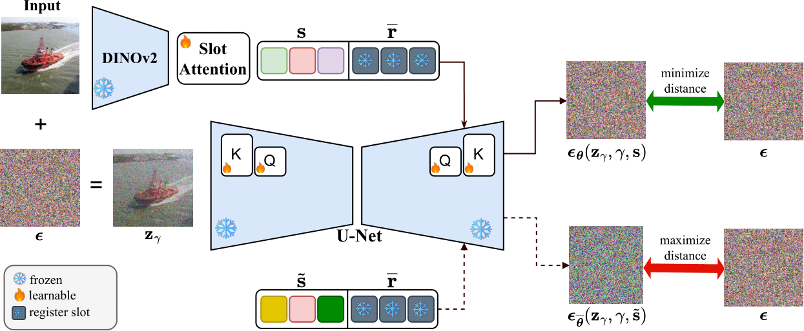

# CODA: Contrastive Object-centric Diffusion Alignment

**Improved Object-Centric Diffusion Learning with Registers and Contrastive Alignment** 

> Slot Attention (SA) with pretrained diffusion models has recently shown promise for object-centric learning (OCL), but suffers from **slot entanglement** and **weak alignment** between object slots and image content. We propose Contrastive Object-centric Diffusion Alignment (**CODA**), a simple extension that (i) introduces register slots to absorb residual attention and reduce interference between object slots, and (ii) applies a contrastive alignment loss to explicitly encourage slot–image correspondence. 

[](./LICENSE)
[](https://github.com/sony/coda) [](https://arxiv.org/abs/2601.01224) [](https://huggingface.co/bacnguyen/coda)

<div align="center">

</div>


## 🚀 Installation
The training and evaluation code requires PyTorch. Clone the repository then use `requirements.txt` to install dependencies
```
pip install -r requirements.txt
```


## Data preparation
All datasets will be downloaded and placed at `$USER_DATA`. Run the following command to get the data.

```bash
# define where to store data 
export USER_DATA=...

# download the dataset
bash preprocess/download.sh voc coco movi-c movi-e
```

## 🎮 Training
We use the following script for training.
```bash
bash scripts/train.sh <dataset>
```
where `dataset` can be one of [`voc`, `coco`, `movi-c`, `movi-e`].

To enable logging with `wandb`, place your API key in a [`.key`](.key) file.

## 📝 Evaluation
The diffusion pipeline can be loaded as follows.
```python
from src.model.pipeline import DiffusionPipeline

image = <image_tensor>
model_path = <path_to_pretrained_model>
model = DiffusionPipeline.from_pretrained(model_path).to("cuda")

with torch.no_grad():
    slots = model.encoder(image)
    image_rec = model.sample(slots, resolution=512)
```

We use the following script for evaluation.
```bash
bash scripts/eval.sh <dataset>
```
where `dataset` can be one of [`voc`, `coco`, `movi-c`, `movi-e`].


📥 **Pretrained models are available.**
<div align="center">
<table style="margin: auto">
<thead>
  <tr>
    <th>Dataset</th>
    <th>FG-ARI⬆️</th>
    <th>mBO<sup>i</sup>⬆️</th>
    <th>mBO<sup>c</sup>⬆️</th>
    <th>mIoU<sup>i</sup>⬆️</th>
    <th>mIoU<sup>c</sup>⬆️</th>
    <th>Download</th>
  </tr>
</thead>

<tbody>
  <tr>
    <td>MOVi-C</td>
    <td>59.19</td>
    <td>46.55</td>
    <td>—</td>
    <td>51.94</td>
    <td>—</td>
    <td>
    <a href="https://huggingface.co/bacnguyen/coda/tree/main/movi-c">
      
    </a>
    </td>
  </tr>
  <tr>
    <td>MOVi-E</td>
    <td>59.04</td>
    <td>43.45</td>
    <td>—</td>
    <td>45.21</td>
    <td>—</td>
    <td>
    <a href="https://huggingface.co/bacnguyen/coda/tree/main/movi-e">
      
    </a>
    </td>
  </tr>
  <tr>
    <td>VOC</td>
    <td>32.23</td>
    <td>55.38</td>
    <td>61.32</td>
    <td>50.77</td>
    <td>56.30</td>
    <td>
    <a href="https://huggingface.co/bacnguyen/coda/tree/main/voc">
      
    </a>
    </td>
  </tr>
  <tr>
    <td>COCO</td>
    <td>47.54</td>
    <td>36.61</td>
    <td>41.43</td>
    <td>36.41</td>
    <td>42.60</td>
    <td>
    <a href="https://huggingface.co/bacnguyen/coda/tree/main/coco">
      
    </a>
    </td>
  </tr>
</tbody>
</table>
</div>

## 📝 Citation

Please cite our paper if you find it useful in your research:

```
@article{nguyen2026coda,
  title={Improved Object-Centric Diffusion Learning with Registers and Contrastive Alignment}, 
  author={Bac Nguyen and Yuhta Takida and Naoki Murata and Chieh-Hsin Lai and Toshimitsu Uesaka and Stefano Ermon and Yuki Mitsufuji},
  year={2026},
  journal={arXiv 2601.01224},
}
```

## Acknowledgement

We thank the authors of [SlotDiffusion](https://github.com/Wuziyi616/SlotDiffusion), [Latent Slot Diffusion](https://github.com/JindongJiang/latent-slot-diffusion) and [Latent Diffusion Models](https://github.com/CompVis/latent-diffusion) for making their implementations publicly available.

## License

CODA is released under the Apache License 2.0. See the [LICENSE](./LICENSE) file for more details.
